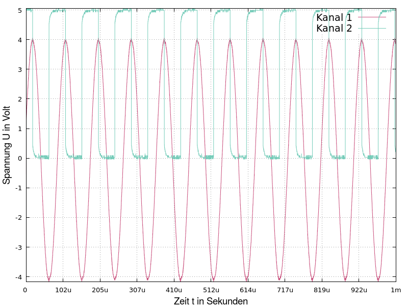

# gpOskar

This program constructs a gnuplot program call from individual voltage measurements, which has been optimized for inclusion in documents. The plot thus represents a snapshot of a digital oscilloscope screen. 
The program calculates the optimal axis scaling in t-y mode and the default configuration file for gnuplot can easily be extended to perform measurement interpolation, signal analysis, or anything else. 

 </td>

##  Build

The project can be built by using `make`. 
You need a working gnuplot installation with version >=5.0 

## Usage 
You need raw data from your oscilloscope in the following form: 
#header 
Voltage value in volts 
Voltage value in volts 
...
#header 
Voltage value in volts 
...

The header contains the channel and the time resolution in seconds as e-notation in the form: #CHX, time resolution. 
Example: 
#CH1,2e-08 
1.42279 
1.5 
1.57965 
...

Currently two channels are supported in one graphic.
The raw data should be stored as ASCII text and the basic gnuplot config file is in /src

## Licence

This program by Michael Krause is licenced under the terms of the [GPLv3](https://www.gnu.org/licenses/gpl-3.0.de.html). 
Please note that gnuplot is an independent software that is not from the gpOskar author. gnuplot has its own licensing terms.
